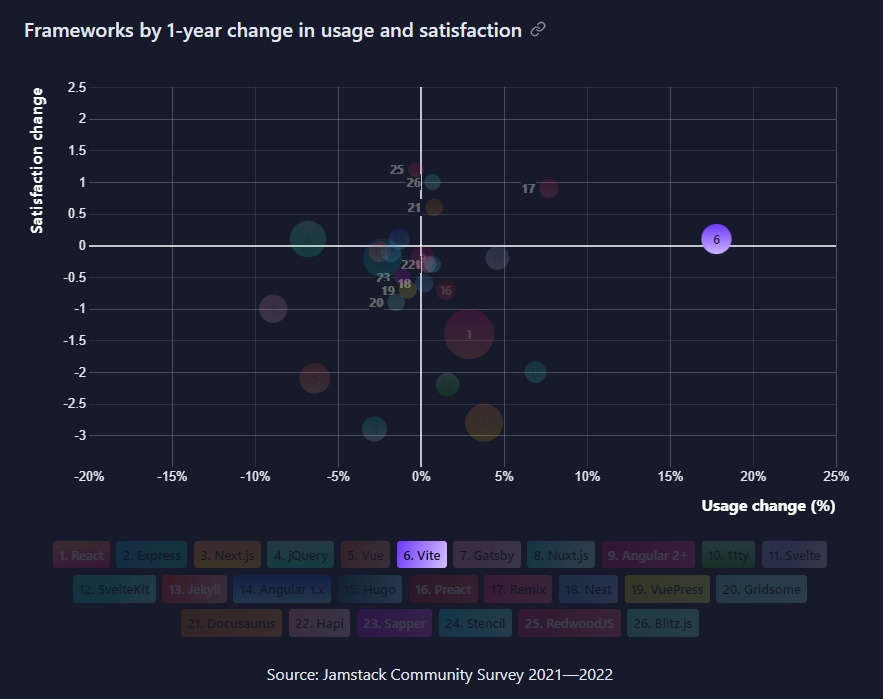

##### Oprowadzenie po technologiach z których będziemy korzystać

#  GitHub

Pozwoliłem sobie wrzucić githuba na pierwsze miejsce, ponieważ to z niego będziemy musieli umieć sensownie korzystać.

Opiszę wam mniej więcej to co powinniście potrafić językiem dosyć kolokwialnym i zapewne w wielu miejscach mogę się mylić, ale powinno to po przeczytaniu tego powinno być wam trochę łatwiej się z tym poruszać.

## Wstęp o GitHub i Git

Ogólnie, Git i GitHub to nie są dokładnie te same rzeczy. W skrócie:

Git to system kontroli plików który może sobie działać lokalnie na komputerze bez potrzeby korzystania z serwisów które z Gitem "współgrają", takich jak właśnie GitHub, BitBucket czy GitLab.

No a GitHub to właśnie taka stronka która z Gitem współgra.

Zatem kiedy tworzymy sobie lokalnie brancha (o nich później), coś na nim commitujemy (o tym też zaraz) i tego nie pushniemy (o tym też zaraz) to tak naprawdę cały czas działamy lokalnie i w zasadzie korzystamy tylko z Gita a nie GitHuba.

## Podstawowe pojęcia związane z Gitem

W Git'cie mamy do czynienia z branchami. Głównym branchem zazwyczaj nazywamy branch `main` lub `master`. Zwykle posiadają specjalne właściwości.

U nas branch ten będzie się nazywał `main` i nie będzie można na niego wrzucać kodu bez zatwierdzenia przez innych. Wystawienie kodu do sprawdzenia nazywamy "Pull Request" (w skrócie PR), natomiast zatwierdzanie i review kodu nazywamy "Code Review". Aby wasz kod trafił na maina będziecie musieli go w taki sposób przedstawić reszcie grupy i przygotować się na poprawki.

Swój kod będziecie pisać na osobnych branchach. Jednak zanim będziecie je tworzyć, zaciągnijcie aktualny kod z githuba żebyście nie tworzyli brancha na starym kodzie:

```
git fetch
git checkout main
git pull origin main
```

Brancha można stworzyć komendą:

```
git branch <nazwa brancha>
```

Natomiast żeby się na danego brancha przenieść korzystamy z komendy:

```
git checkout <nazwa brancha>
```

> Disclaimer: Nie będzieciem mogli zmienić brancha jeżeli będziecie mieli nie scommitowane/zestashowane zmiany, o commitach jest niżej

W tym momencie powinniście znaleźć się na wybranym przez siebie branchu, aby to sprawdzić możecie skorzystać z tej komendy:

```
git status
```

## Inne przydatne komendy powiązane z branchami

Wyświetlanie wszystkich pobranych branchy:

```
git branch
```

Usunięcie brancha: (jest to usunięcie lokalne, by usunąć go z GitHuba trzbea byłoby użyć innej komendy)

```
git branch --delete <nazwa brancha>
```

## Metodologia pisania kodu na swoim branchu

W momencie gdy macie już zrobionego swojego brancha to możecie spokojnie na nim pisać.

Do zatwierdzania zmian będziecie korzystać z w sumie dwóch głównych komend, które warto odróżniać. Tutaj znów przydaje się świadomość tego że to co robicie, robicie na Git'cie lokalnie, dopiero po konkretnych komendach wasz kod trafia na GitHuba, zatem:

Kiedy zdecydujecie się by zatwierdzić zmiany korzystacie z tak zwanego commita. Commit to nic innego jak "zapisanie" zmian w kodzie. Aby z niego skorzystać musimy najpierw wybrać pliki które chcemy commitować.

Możecie zatem do kolejki dodać konkretny plik:

```
git add <ścieżka do plików>
```

Lub możecie dodać wszystkie pliki które uległy zmianie/zostały utworzone: (głównie z tego będziecie korzystać)

```
git add .
```

Następnie by wprowadzić commita piszecie:

```
git commit -m "<nazwa commita>"
```

Ważne jest to by korzystać z flagi `-m` i sensownie te commity nazywać, żebyście zarówny wy, jak i inni mogli wiedzieć co do kodu wprowadziliście.

Znów, uwaga. To co właśnie commitowaliście wciąż jest u was tylko lokalnie. Nie znajduje to się jeszcze na GitHubie. Aby więc to na niego wrzucić należy skorzystać z pusha:

```
git push
```

Przy pushu bardzo często wyskakują różne smaczki które zazwyczaj zniechęcają do nauki gita, ale warto je przeboleć i się nauczyć co tak naprawdę znaczą. Nie wymienię ich tutaj, ale kiedy będziecie mieć jakiś problem to pamiętajcie że możecie się odezwać (lub sprawdzić na stacku, albo na chatGPT :D)

Istnieje też tzw force push, który wykona wam pusha pomimo różnych niezgodności. Używa się go w naprawdę skrajnych sytuacjach (w niektórych jest konieczny więc nie jest to zła operacja, ale bardziej ostateczna niż normalna):

```
git push -f
```

Warto również wspomnieć o tym, że jeśli wprowadziliście do kodu jakieś zmiany, ale niekoniecznie chcecie je commitować, możecie skorzystać z komendy git stash, usuwa ona wszystkie wprowadzone zmiany do ostatniego commita:

```
git stash
```

Jest to bardzo wygodne narzędzie w połączeniu z commitowaniem. Daje to wam możliwość eksperymentowania kodu. Załóżmy że macie już jakieś sensowne zmiany w kodzie zrobione, ale boicie się, że jak wprowadzicie jakieś eksperymentalne duże zmiany, to zepsuje wam się kod i nie będziecie pamiętali co wprowadziliście (a ctrl+z ma ograniczoną ilość cofnięć). Zatem przed wprowadzeniem zmian robicie commita, piszecie te eksperymentalne zmiany i w ewentualności jeśli wam nie zadziałają i chcecie je porzucić, wykorzystujecie git stash i po robocie.

Gdy wasz kod będzie gotowy do wystawienia na maina, będziecie tworzyli pull requesta. Będę pokazywał jak się pull requesta tworzy, jak czytać code review, jak wystawiać code review, no i jak mergować do maina (co jest najcięższym etapem bo będziecie pracowali często z konfliktami).

> GitHuba postaram się opisać na zebraniu, albo dopisać tutaj jeszcze

#  React

O React'cie nie będę się za dużo rozpisywał. Jest to biblioteka do budowania interfejsów. Niby nie jest to framework bo nie posiada mnóstwa narzędzi takich jak Angular, ale wprowadza tyle zmian do kodu że pojęcia biblioteka a framework się tu trochę zazębiają.

W React wykorzystujemy pliki JSX/TSX. Co prawda nasze komponenty mogą być pisane w plikach `.js`, my jednak dla zachowania konwencji będziemy pisać `.jsx`.

Generalna struktura Reacta działa w taki sposób, że piszemy reaktywne, reużywalne komponenty, co pozwala zachować zasadę DRY (don't repeat yourself), oraz w znaczny sposób upraszcza nam strukturę strony.

Podstawowym narzędziem Reacta są tzw. hooki. Nie są one w żadnym stopniu skomplikowanym narzędziem (przynajmniej te podstawowe) i by zbudować cokolwiek w React należy umieć chociaż ten jeden `useState`.

Odsyłam do docsów Reacta, tam jest to spoko wytłumaczone:
[HOOKI](https://reactjs.org/docs/hooks-reference.html), oraz do bardzo fajnego youtubera który też super tłumaczy (nie tylko hooki ale wiele rzeczy powiązanych z Reactem i webdevem): [React hooks explained playlist](https://www.youtube.com/watch?v=O6P86uwfdR0&list=PLZlA0Gpn_vH8EtggFGERCwMY5u5hOjf-h).

#  SCSS

SCSS jest tylko (i aż) udoskonaleniem języka CSS. Wprowadza on kilka przydatnych mechanik by ciut przyjemniej się nam pisało style, między innymi:

- nesting
- możliwość pisania funkcji
- wygodne zmienne
- tworzenie reużywalnych fragmentów stylów

O co chodzi z tym nestingiem? W skrócie, w CSS jeśli mamy np taką sytuację:

```html
<div className="container">
  <button onClick="{handleClick}" />
</div>
```

W CSS jeśli chcielibyśmy dotrzeć do tego buttona skorzystalibyśmy z czegoś takiego:

```css
.container > button {
  padding: 10px;
}
```

W SCSS jest to ciut łatwiejsze, wykorzystujemy tzw. nesting:

```scss
.container {
  button {
    padding: 10px;
  }
}
```

Wydaje sie to w tym przypadku dosyć... mało użyteczne? Był to dosyć mały przykład, z każdym kolejnym dołożeniem kodu rozmiar plików CSS skaluje się potężnie, w SCSS jest to mniej zauważalne:

```css
.container {
  width: 100px;
  height: 100px;
}
.container:hover {
  background-color: red;
}
.container > button {
  padding: 10px;
}
.container > button:hover {
  padding: 20px;
}
```

A:

```scss
.container {
  width: 100px;
  height: 100px;
  &:hover {
    background-color: red;
  }
  button {
    padding: 10px;
    &:hover {
      padding: 20px;
    }
  }
}
```

Gdzie `&` oznacza, że odnosimy się do tego elementu, w którym to postawimy.

#  Vite (czytaj wit, bo z francuskiego)

Vite jest czymś co pojawiło się bardzo niedawno na rynku. Jest to build tool od twórcy Vue (innego frameworka js). W skrócie **znacznie** przyspiesza nam on odpalanie strony i jest również bardzo wygodnym narzędziem do zbudowania boilerplate'u aplikacji. W skrócie - jeśli nic się nie zmieni, `create-react-app` odejdzie do lamusa.

Vite również wprowadza support do popularnych narzędzi takich jak TS, SCSS, LessCSS itp. Żeby postawić Reacta z TS i scssem trzeba się leciutko napocić, natomiast z Vitem robimy to automatycznie.

Vite również rozbija swoją popularnością dlatego pomyślałem, że skorzystamy z niego żebyśmy poznali coś świeżego.

Polecam obejrzeć: [Vite in 100 seconds](https://www.youtube.com/watch?v=KCrXgy8qtjM&t=84s)

> Uwaga! W związku z tym że pracujemy w Vite, naszą aplikację uruchamiamy tą komendą:

```
npm run dev
```

Statystyki Jamstack 2022:



